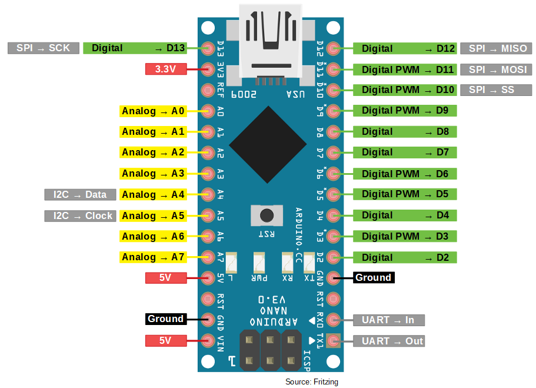
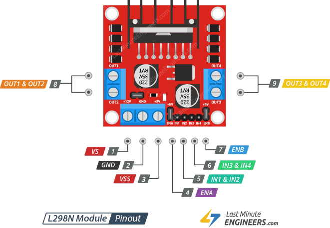

# Joystickmotor – Arduino Projekt

## Hardware
- **Mikrocontroller:** Arduino Nano
- **Motorcontroller:** L298N (Dual H-Bridge)
- **Joystick:** KY-023 (analog X/Y + Taster)
- **Antrieb:** Differentialantrieb mit 2 Motoren + Schlepprad

## Arduino Nano Pinout

## Joystick Belegung (KY-023)
| Joystick Pin | Arduino Pin | Funktion | Kabelfarbe |
|-------------|-------------|----------|------------|
| VCC | 5V | Stromversorgung | Rot |
| GND | GND | Masse | Schwarz |
| VRx | A1 | X-Achse (Lenken) | Braun |
| VRy | A0 | Y-Achse (Fahren) | Grün |
| SW  | D2 | Taster (Sofortstopp) | Grau |

## L298N Belegung
| Pin | Funktion | Kabelfarbe |
|-----|----------|------------|
| D3  | ENA – PWM Motor Links | Orange |
| D5  | IN1 – Motor Links | Gelb |
| D6  | IN2 – Motor Links | Grün |
| D9  | IN3 – Motor Rechts | Blau |
| D10 | IN4 – Motor Rechts | Lila |
| D11 | ENB – PWM Motor Rechts | Grau |

## L298N Pinout

## Hinweise
- Joystick SW-Pin nutzt internen Pull-up (`INPUT_PULLUP`), kein externer Widerstand nötig
- L298N 5V-EN-Jumper gesetzt – versorgt den Arduino Nano
- Motor Rechts: + und - getauscht wegen Einbaulage
- Totzone: 50 (verhindert ungewolltes Fahren in Joystick-Mittelstellung)
